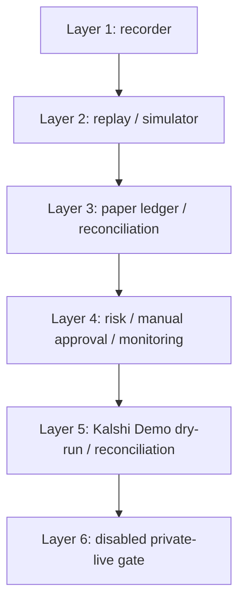
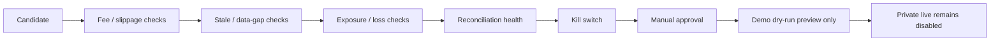

# Event-Driven Market Neutral Trader

`event-driven-market-neutral-trader` is a risk-gated Python research platform
for same-market YES/NO complement-parity workflows in prediction markets. It
normalizes local or read-only market data, scans for complement-parity research
records, simulates paper/demo behavior, records risk and approval state, and
keeps the private live gate disabled in the public repository.

This is not a production trading system, prediction bot, LLM trader,
investment-advice product, or guaranteed-profit system. It is a public
execution-readiness and research-infrastructure project with live execution
intentionally disabled.

## System Workflow

```mermaid
flowchart LR
  A["Market data / fixtures"] --> B["Normalized order book"]
  B --> C["Complement scanner"]
  C --> D["Fee / slippage / failed-leg simulator"]
  D --> E["Paper proposal"]
  E --> F["Paper ledger"]
  F --> G["Risk decision"]
  G --> H["Manual approval"]
  H --> I["Kalshi Demo dry-run connector"]
  I --> J["Demo reconciliation"]
  J --> K["Rolling validation"]
  K --> L["Disabled private-live gate"]
```



The first venue shape is Kalshi-style binary markets. Kalshi exposes YES bids
and NO bids; the normalizer converts that into a canonical YES-side book:

```text
implied_yes_ask = 1 - best_no_bid
gross_edge = best_yes_bid + best_no_bid - 1
```

Those formulas create research records only. Candidates still require explicit
fee assumptions, slippage assumptions, stale-data checks, failed-leg reserves,
paper replay, risk review, manual approval, demo reconciliation, and long-term
validation before any private-live discussion.

## Architecture Layers



| Layer | Purpose | Public status |
| --- | --- | --- |
| Core models | Decimal order books, quotes, positions, execution modes, risk limits | Implemented |
| Venue adapters | Kalshi Demo read-only client, Polymarket US public recorder, SEC EDGAR facts | Read-only / fixture-tested |
| Data replay | JSONL snapshots, live-event envelopes, order book rebuilds | Local/replay-first |
| Complement research | Candidate model, fee model, offline scanner | Audit/paper records only |
| Simulation | Taker fill, slippage, failed-leg reserve assumptions | Offline fixtures only |
| Paper workflow | Paper proposals, paper ledger, risk decisions, manual approval records | Non-executable |
| Demo workflow | Kalshi Demo dry-run previews, mocked submit path, reconciliation replay | Demo/paper research only |
| Validation | Daily and rolling 7/30/90-day paper/demo reports | Framework implemented; validation not completed |
| Private live gate | Disabled public placeholder and design document | Disabled |

## Current Capabilities

- Kalshi-style YES/NO order book normalization with deterministic tests.
- Guarded read-only Kalshi Demo and Polymarket US public market-data recorders.
- Offline complement-parity candidate scanning from local fixtures/snapshots.
- Explicit Decimal fee, slippage, and failed-leg reserve assumptions.
- Offline taker-fill simulation and deterministic paper proposal generation.
- Replayable paper ledger with source hashes, positions, fees, PnL, and
  mismatch tracking.
- Paper-only risk decisions that reject stale data, gaps, missing/unknown fees,
  insufficient edge, exposure breaches, loss limits, mismatches, and kill
  switch state.
- Hash-bound manual approval records with expiry and single-use protections.
- Kalshi Demo dry-run connector previews plus mocked submit-path tests.
- Local Demo reconciliation replay for accepted, rejected, partial/full fill,
  cancel, error, timeout, and backfill-style events.
- Daily and rolling validation reports over local paper/demo artifacts.
- Disabled private-live gate with all private-live prerequisites still unmet.

## Quickstart

Use Python 3.12.

```bash
python -m pip install -e ".[dev]"
pytest
ruff check .
```

On this migrated Mac checkout, root wrapper scripts may need the local import
fallback:

```bash
PYTHONPATH=src python scripts/01_replay_orderbook_fixture.py
```

## Example Local Workflow

Replay the included Kalshi-style fixture:

```bash
PYTHONPATH=src python scripts/01_replay_orderbook_fixture.py
```

Record and replay deterministic snapshots:

```bash
PYTHONPATH=src python scripts/02_record_fixture_snapshots.py --output /tmp/edmn_snapshots.jsonl
PYTHONPATH=src python scripts/03_replay_snapshots.py --input /tmp/edmn_snapshots.jsonl
```

Run the offline complement scanner:

```bash
PYTHONPATH=src python scripts/23_scan_complement_arb.py \
  --input /tmp/edmn_snapshots.jsonl \
  --input-kind snapshot-jsonl \
  --jsonl-output /tmp/edmn_candidates.jsonl \
  --markdown-output /tmp/edmn_candidates.md
```

Inspect later-stage CLIs:

```bash
PYTHONPATH=src python scripts/43_simulate_taker_fill.py --help
PYTHONPATH=src python scripts/44_paper_complement_engine.py --help
PYTHONPATH=src python scripts/45_replay_paper_ledger.py --help
PYTHONPATH=src python scripts/46_complement_risk.py --help
PYTHONPATH=src python scripts/47_manual_approval.py --help
PYTHONPATH=src python scripts/48_daily_validation_report.py --help
PYTHONPATH=src python scripts/49_kalshi_demo_connector.py --help
PYTHONPATH=src python scripts/50_kalshi_demo_reconciliation.py --help
PYTHONPATH=src python scripts/51_long_term_validation.py --help
```

## Safety Model



- Public live execution is disabled.
- `LIVE_DISABLED` is the only live-related core execution mode.
- The public private-live placeholder returns `status="disabled"`.
- The repo does not contain production order code, production endpoint
  configuration, credentials, wallets, broker integration, or live user-order
  channels.
- Research records are audit/paper/demo infrastructure records, not trade
  recommendations.
- No stage claims positive expectancy, production readiness, or persistent
  profitability.

See [docs/RISK_POLICY.md](docs/RISK_POLICY.md) and
[docs/private_live_execution_gate.md](docs/private_live_execution_gate.md).
For the compact diagram set, see
[docs/visual_overview.md](docs/visual_overview.md).

## Validation Status

The public repo has local test coverage for the implemented workflow through
Stage 52. Stage 51 added the rolling validation framework, but validation is
not completed because the required private evidence does not exist in this
public repository.

Private-live prerequisites still unmet:

- 30-90 days live read-only data
- 30+ days paper trading history
- zero unresolved reconciliation mismatches
- validated fee/slippage assumptions
- successful demo lifecycle coverage
- kill-switch and manual approval drills
- legal/platform compliance review

## Repository Map

- [docs/ARBITRAGE_ROADMAP.md](docs/ARBITRAGE_ROADMAP.md): Stage 35-52
  complement-parity roadmap.
- [docs/visual_overview.md](docs/visual_overview.md): Mermaid diagrams for the
  workflow, architecture, safety gate, and public/private boundary.
- [docs/portfolio_summary.md](docs/portfolio_summary.md): concise portfolio
  framing for reviewers.
- [docs/release_notes_stage_52.md](docs/release_notes_stage_52.md): draft
  GitHub Release title, description, scope, and validation copy.
- [docs/resume_bullets_stage_52.md](docs/resume_bullets_stage_52.md):
  resume-ready bullets for the completed public Stage 52 state.
- [docs/STAGE_PLAN.md](docs/STAGE_PLAN.md): completed stage ledger and
  validation commands.
- [docs/current_handoff.md](docs/current_handoff.md): latest continuation state.
- [docs/repo_map.md](docs/repo_map.md): targeted file map for maintainers.
- [docs/engineering_log.md](docs/engineering_log.md): stage-by-stage narrative.
- [CHANGELOG.md](CHANGELOG.md): external-facing milestone log.

## Intended Audience

This repository is written for technical reviewers, collaborators, recruiters,
and future maintainers who want to inspect a realistic prediction-market
research workflow with explicit safety gates. The interesting work is the
sequence of small, testable boundaries: normalization, replay, candidate
generation, simulation, paper accounting, risk, approval, demo reconciliation,
rolling validation, and disabled-live design.

## License And Disclaimer

This repository is research and engineering infrastructure. It is not
investment advice, executable trading advice, or a claim that any strategy is
profitable. Production trading and real-money execution are disabled in the
public repository.
