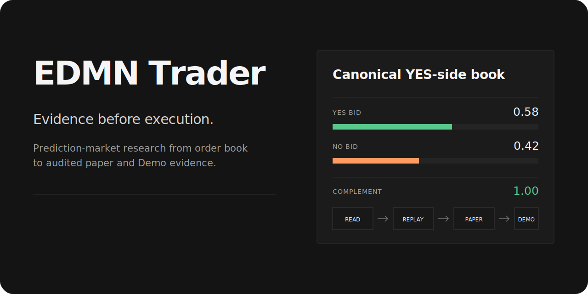
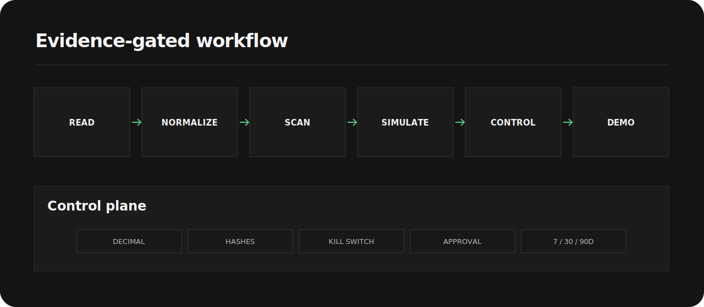
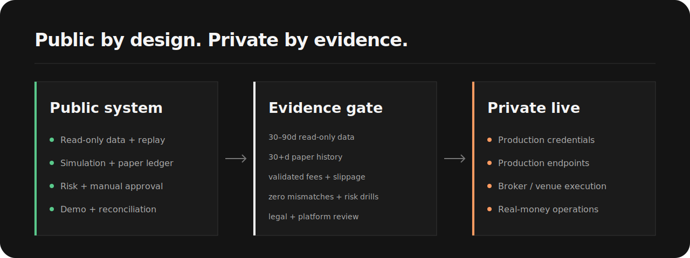

<p align="center">
  
</p>

<p align="center">
  <a href="https://github.com/minqiyang/edmn-trader/actions/workflows/ci.yml"></a>
  
  
</p>

EDMN Trader turns binary prediction-market books into auditable same-market
complement-parity evidence: normalize, scan, stress, paper, risk-gate,
reconcile, validate.

> [!IMPORTANT]
> Public scope is research, paper, and Kalshi Demo. Production endpoints,
> credentials, and real-money execution are intentionally absent.



## Core

| Layer | Contract |
| --- | --- |
| Inputs | Kalshi Demo read-only data, Polymarket US public data, and local fixtures. |
| Semantics | Canonical Decimal YES-side books and same-market complement candidates. |
| Stress | Explicit fees, slippage, latency, partial fills, and failed-leg reserves. |
| Controls | Source hashes, paper ledger, risk limits, kill switch, and manual approval. |
| Demo | Dry-run previews, a guarded submit boundary, and deterministic reconciliation. |
| Evidence | Daily reports plus a rolling 7/30/90-day validation framework. |

## Market Contract

```text
implied_yes_ask = 1 - best_no_bid
gross_edge      = best_yes_bid + best_no_bid - 1
```

These formulas create research candidates, never executable instructions.

## Quickstart

```bash
python3.12 -m venv .venv
source .venv/bin/activate
python -m pip install -e ".[dev]"
pytest
ruff check .
PYTHONPATH=src python scripts/01_replay_orderbook_fixture.py
```

## Research Stack

EDMN Trader sits beside
[Equity Factor Research](https://github.com/minqiyang/equity-factor-research),
the factor-research sister project; it is not a runtime dependency. EDMN owns
event-market normalization through paper/Demo evidence. Any future real-money
system remains a separately reviewed private layer behind the evidence gate.

## Safety Boundary



See [Risk Policy](docs/RISK_POLICY.md) and
[Private Live Gate](docs/private_live_execution_gate.md).

## Project Records

[Specification](PROJECT_SPEC.md) ·
[Roadmap](docs/ARBITRAGE_ROADMAP.md) ·
[Visual overview](docs/visual_overview.md) ·
[Stage ledger](docs/STAGE_PLAN.md) ·
[Current handoff](docs/current_handoff.md)

## Disclaimer

Research and engineering infrastructure only. Not investment advice, trading
advice, a profitability claim, or a production trading system.
