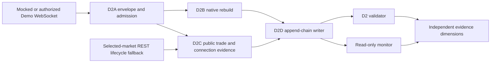

# D2E Read-Only WebSocket Runtime Integration

D2E makes the reviewed `kalshi-ws-smoke` and `kalshi-ws-campaign` entrypoints
select the D2 runtime artifact contract. Historical
`v2.readonly_campaign.v1` artifacts remain readable by the validator and
monitor, but new WebSocket runs cannot select the legacy writer.

## Runtime Contract

`edmn.kalshi.ws.runtime.v2` records:

- raw, runtime-record, append-chain, checkpoint, and segment-summary schema
  versions;
- public commit, branch, remote, and dirty state;
- campaign identity, mode, configured and actual duration, connected duration,
  connection windows, disconnect durations, and terminal reason;
- `edmn.v2.thresholds.v1`, its effective time, and source commit;
- selected-market metadata, the evaluated smoke/canary/seven-day selection
  policy, and explicit lifecycle and pricing provenance;
- D2A segment/sequence/admission summaries;
- D2B frame hashes, terminal-state hashes, pricing modes, excluded rows, and
  invalidation reasons;
- D2C public-trade, lifecycle, connection, and three-dimensional freshness
  evidence;
- D2D append-chain, atomic-checkpoint, close-hash, rotation, and recovery
  metadata;
- twelve independent classifier dimensions and a non-overridable disabled-live
  safety state.

The durability record wraps the complete D2A envelope. Its own
`local_row_index` is segment-local so rotation can start a fresh append chain
without changing the D2A transport row index. Rotation closes and hashes the
old file once; event callbacks never scan or hash the full file.
The first checkpointed record binds launch-time market/selection metadata,
repository and threshold provenance, required public channels, command `1`,
and explicit `use_yes_price=false` pricing semantics.
Per-frame hashes remain in chained event records. Runtime summaries retain a
constant-size frame-hash chain and latest hash rather than an unbounded list.
Open status is refreshed on a checkpoint, segment change, or bounded interval,
not rewritten for every frame.

## Evidence Boundaries

- D2A admission controls D2B mutation. Excluded rows remain durable evidence
  but cannot change native book state or refresh selected-market snapshot and
  orderbook-freshness evidence.
- Every connection and resubscription must receive its own channel
  acknowledgment bound to command `1` and the complete `orderbook_delta` plus
  `trade` channel set; an acknowledgment from an earlier connection is never
  carried forward.
- Subscription PASS is reconstructed from the durable raw channel
  acknowledgment frames for every connection and cross-checked against typed
  connection evidence; the complete raw channel acknowledgment must precede
  the typed acknowledgment, and typed acknowledgment alone cannot pass.
- Subscription identity is scoped by connection/segment generation and
  channel. The registry retains request/command ID, SID, and observed market
  tickers independently for `orderbook_delta` and `trade`; a SID alone is not
  a global identity.
- Public trade/status channel SIDs cannot reset orderbook snapshot or sequence
  state. Native book identity and hashes bind only the active
  `orderbook_delta` request ID and SID, while D2C retains public trade identity
  independently.
- Increasing sequence values under unknown semantics remain unknown; they do
  not establish continuity.
- REST lifecycle fallback proves lifecycle only, never WebSocket transport.
- Quiet public trades are valid. Public trades are not account fills.
- Ping/Pong/heartbeat freshness is `UNKNOWN_NOT_OBSERVED` unless the recorder
  receives an observable frame.
- Snapshot/delta transport does not imply rebuild, duration, backup, sequence,
  supervisor, or replay qualification.
- Pricing or identity metadata contradictions on control frames are retained as
  rebuild invalidation reasons; a valid earlier snapshot cannot hide them.
- `replay_qualification` remains `UNKNOWN` and `replay_qualified` remains
  false for D2E software evidence.

## Recovery and Compatibility

Open segments expose checkpoint-bounded integrity. Clean close verifies the
append chain, checkpoint, and one closed-file SHA-256. Crash recovery validates
complete rows after the checkpoint, removes only a partial final row, records
`snapshot_required=true`, records `inherited_book_state=false`, and never
automatically restarts a campaign.

Detached deployments record `branch=DETACHED_HEAD` instead of failing before
preflight. Blocked discovery preserves its intended selection profile and
coverage metadata. Crash recovery synchronizes terminal timing and summary
artifacts, remains fail-closed for process evidence, and is consumable by the
D2 validator and monitor without starting a replacement process.

The validator dispatches by runtime schema. D2 artifacts receive full terminal
chain/hash/safety verification, and critical counts and classifier dimensions
are independently derived from durable runtime records rather than trusted
from mutable summaries. The monitor blocks on validator failure. Legacy v1
artifacts continue through the historical reader without being rewritten or
promoted.

Terminal validation cross-checks row counts and byte offsets across chain,
checkpoint, manifest, and segment summary, and requires exact reviewed
threshold-policy provenance. Failed lifecycle observations advance the polling
attempt clock so a venue outage cannot create a request per WebSocket frame.
Private account, order, and fill fields are rejected recursively before raw D2A
persistence. Persisted HTTP(S) Git remotes omit userinfo, query, and fragment
components so repository provenance cannot retain embedded credentials.
Provenance is collected from the imported public package repository, never the
operator's current working directory. New runtime and preflight roots must be
empty, and selected-market metadata receives the same private account/order
screening as transport payloads.

Recovery derives runtime counts from the closed chain, including complete tail
rows written after the last checkpoint. Validator rebuild integrity comes from
replaying durable D2A envelopes through a fresh D2B instance and comparing the
full persisted result and aggregate rebuild/sequence/freshness summaries, not
from trusting stored frame validity or hashes. Recovery writes those same
derived semantic summaries after reconciling complete tail rows.
The full `EvidenceTiming` record and terminal disposition are written as a
chained terminal record. Recovery closes a separate evidence-only terminal
segment, without opening transport or inheriting book state.
If a crash occurs after the normal terminal append but before close, recovery
preserves that single authoritative terminal instead of adding another.
Recovery also reconciles a segment finalized immediately before its manifest
update, including the next open segment created by rotation.
Durable campaign identity and closed-file hashes are cross-checked against all
summary artifacts.
Validator comparison covers every persisted D2D segment-summary field. D2C
public trades are regenerated from D2A, while lifecycle and connection records
must reconstruct through their typed contracts and selected-market identity.
Completed D2 roots are revalidated by the read-only monitor without rewriting
the persisted validation report; unreadable fixed metadata fails monitor health
closed. Recovery records preserve pre/post file sizes so partial-tail counts are
independently bounded, and recovery rejects symlink aliases across the
manifested evidence tree before any artifact mutation.
Preflight-blocked artifacts retain their explicit `blocked` validator result
without entering terminal-chain validation.

Disconnect accounting covers runtime start through the first connection and
the final close through terminal time, not only gaps between connections.
Maximum keepalive, lifecycle, and orderbook quiet ages likewise include the
interval from runtime start to the first applicable observation.
Validator subscription evidence is ordered and connection-bound for every D2A
row, and D2A transport indices must remain globally contiguous. A durable
callback failure terminates the recorder instead of entering reconnect logic.
Subscription control frames may precede the combined public-channel
acknowledgment; data frames may not. Connection identities are unique and all
connection windows must fit without overlap inside terminal timing boundaries.
Terminal validation and recovery stream D2A rows through bounded accumulators;
the 100,000-event runtime gate stays below the declared 64 MiB peak. A missing
selected-market orderbook observation is `UNKNOWN_NOT_OBSERVED`, never `FRESH`.
Manifest paths must remain relative and resolve inside the run root. Validation
recursively accounts for every distinct segment data/checkpoint/summary path,
including aliases, and recovery rejects any partially created rotation successor
before modifying artifacts. Running monitor snapshots preserve observed
connection, temporally grounded subscription, freshness, lifecycle, sequence,
and rebuild dimensions instead of replacing them with unknown placeholders;
observed critical failures block monitor health immediately.

## Safety

D2E tests use mocked WebSocket and lifecycle transports only. This delivery
does not access a VPS, source credentials, open market network connections,
start a campaign, enable production, invoke account/order channels, or emit a
replay-qualified or real-money claim. The public live gate remains disabled.
