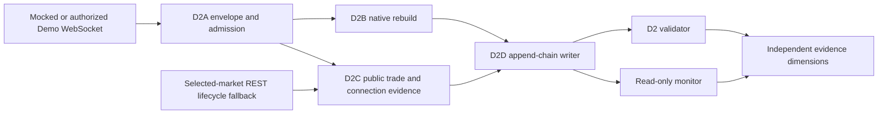

# D2E Read-Only WebSocket Runtime Integration

D2E makes the reviewed `kalshi-ws-smoke` and `kalshi-ws-campaign` entrypoints
select the D2 runtime artifact contract. Historical
`v2.readonly_campaign.v1` artifacts remain readable by the validator and
monitor, but new WebSocket runs cannot select the legacy writer.

## Runtime Contract

`edmn.kalshi.ws.runtime.v2` records:

- raw, runtime-record, append-chain, checkpoint, and segment-summary schema
  versions;
- public commit, branch, remote, and dirty state;
- campaign identity, mode, configured and actual duration, connected duration,
  connection windows, disconnect durations, and terminal reason;
- `edmn.v2.thresholds.v1`, its effective time, and source commit;
- selected-market metadata, the evaluated smoke/canary/seven-day selection
  policy, and explicit lifecycle and pricing provenance;
- D2A segment/sequence/admission summaries;
- D2B frame hashes, terminal-state hashes, pricing modes, excluded rows, and
  invalidation reasons;
- D2C public-trade, lifecycle, connection, and three-dimensional freshness
  evidence;
- D2D append-chain, atomic-checkpoint, close-hash, rotation, and recovery
  metadata;
- twelve independent classifier dimensions and a non-overridable disabled-live
  safety state.

The durability record wraps the complete D2A envelope. Its own
`local_row_index` is segment-local so rotation can start a fresh append chain
without changing the D2A transport row index. Rotation closes and hashes the
old file once; event callbacks never scan or hash the full file.

## Evidence Boundaries

- D2A admission controls D2B mutation. Excluded rows remain durable evidence
  but cannot change native book state or refresh selected-market snapshot and
  orderbook-freshness evidence.
- Every connection and resubscription must receive its own channel
  acknowledgment; an acknowledgment from an earlier connection is never
  carried forward.
- Increasing sequence values under unknown semantics remain unknown; they do
  not establish continuity.
- REST lifecycle fallback proves lifecycle only, never WebSocket transport.
- Quiet public trades are valid. Public trades are not account fills.
- Ping/Pong/heartbeat freshness is `UNKNOWN_NOT_OBSERVED` unless the recorder
  receives an observable frame.
- Snapshot/delta transport does not imply rebuild, duration, backup, sequence,
  supervisor, or replay qualification.
- `replay_qualification` remains `UNKNOWN` and `replay_qualified` remains
  false for D2E software evidence.

## Recovery and Compatibility

Open segments expose checkpoint-bounded integrity. Clean close verifies the
append chain, checkpoint, and one closed-file SHA-256. Crash recovery validates
complete rows after the checkpoint, removes only a partial final row, records
`snapshot_required=true`, records `inherited_book_state=false`, and never
automatically restarts a campaign.

The validator dispatches by runtime schema. D2 artifacts receive full terminal
chain/hash/safety verification, and critical counts and classifier dimensions
are independently derived from durable runtime records rather than trusted
from mutable summaries. The monitor blocks on validator failure. Legacy v1
artifacts continue through the historical reader without being rewritten or
promoted.

## Safety

D2E tests use mocked WebSocket and lifecycle transports only. This delivery
does not access a VPS, source credentials, open market network connections,
start a campaign, enable production, invoke account/order channels, or emit a
replay-qualified or real-money claim. The public live gate remains disabled.
