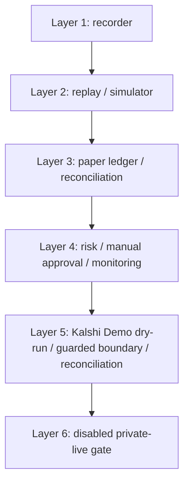
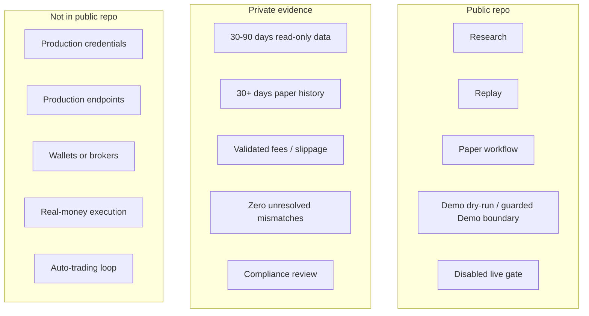

# Visual Overview

This page collects the public diagrams for the post-PR #109 repository state.
The diagrams describe research, replay, paper, demo dry-run, guarded Demo
boundaries, and disabled-live boundaries only.

## System Workflow

```mermaid
flowchart LR
  A["Market data / fixtures"] --> B["Normalized order book"]
  B --> C["Complement scanner"]
  C --> D["Fee / slippage / failed-leg simulator"]
  D --> E["Paper proposal"]
  E --> F["Paper ledger"]
  F --> G["Risk decision"]
  G --> H["Manual approval"]
  H --> I["Kalshi Demo dry-run / guarded Demo submit boundary"]
  I --> J["Demo reconciliation"]
  J --> K["Rolling validation"]
  K --> L["Disabled private-live gate"]
```

## Six-Layer Architecture

## Safety Gate Flow

```mermaid
flowchart LR
  A["Candidate"] --> B["Fee / slippage checks"]
  B --> C["Stale / data-gap checks"]
  C --> D["Exposure / loss checks"]
  D --> E["Reconciliation health"]
  E --> F["Kill switch"]
  F --> G["Manual approval"]
  G --> H["Demo dry-run / guarded Demo boundary"]
  H --> I["Demo reconciliation health"]
  I --> J["Private live remains disabled"]
```

## Public / Private Boundary

The public repository does not contain production endpoints, credentials,
wallets, broker integration, live order placement, strategy optimization,
investment advice, executable trading advice, production-readiness claims, or
profitability claims.
